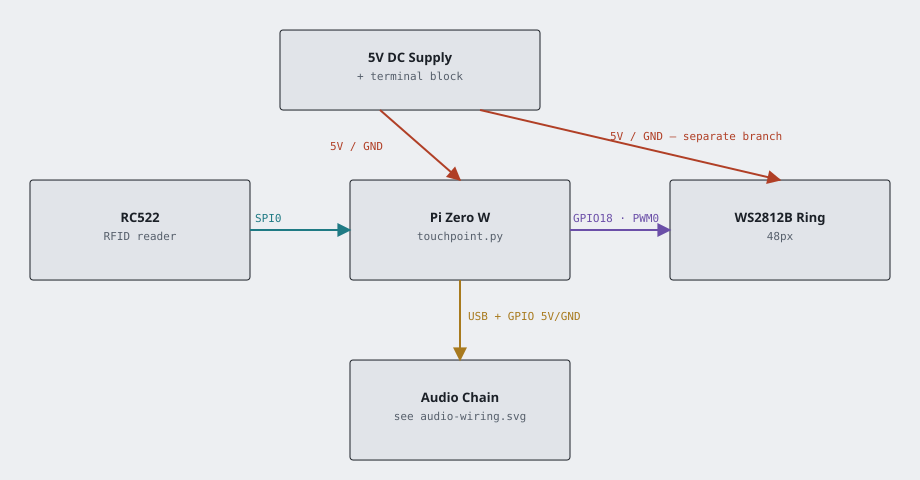
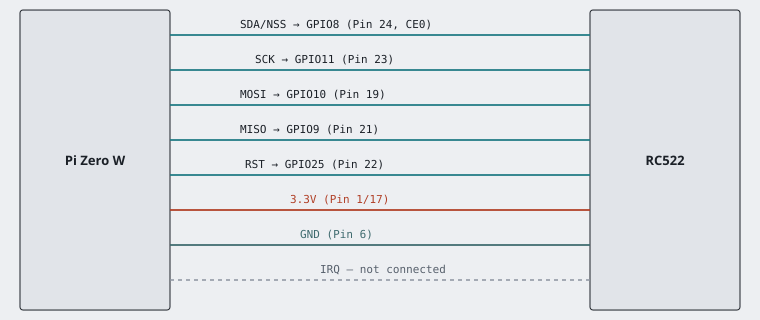
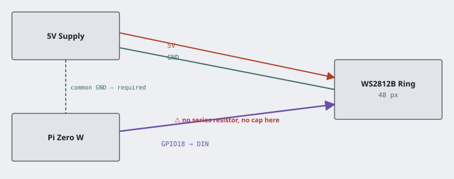
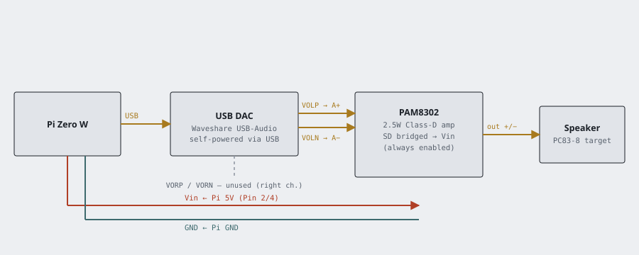

# Disney Touch Point
Using NFC technology, I want to create the Touch Point Disney offers at its entrances for my own personal use at home.   

To include upon read:
- Lights
- Sounds

# Wiring


### [RFID-RC522]([url](https://www.aliexpress.us/item/3256807702682933.html?src=google&pdp_npi=4%40dis%21USD%211.93%211.83%21%21%21%21%21%40%2112000042733086095%21ppc%21%21%21&src=google&albch=shopping&acnt=708-803-3821&isdl=y&slnk=&plac=&mtctp=&albbt=Google_7_shopping&aff_platform=google&aff_short_key=UneMJZVf&gclsrc=aw.ds&albagn=888888&ds_e_adid=&ds_e_matchtype=&ds_e_device=c&ds_e_network=x&ds_e_product_group_id=&ds_e_product_id=en3256807702682933&ds_e_product_merchant_id=5361118735&ds_e_product_country=US&ds_e_product_language=en&ds_e_product_channel=online&ds_e_product_store_id=&ds_url_v=2&albcp=19108282527&albag=&isSmbAutoCall=false&needSmbHouyi=false&gad_source=4&gad_campaignid=19108284222&gbraid=0AAAAAD6I-hG8uvCz8eJx-4KrPtgV7_Q_m&gclid=CjwKCAiA3L_JBhAlEiwAlcWO5zNo3PJEIUwrV0wFFY6Pn6aLm5L0AHmTl1ij-rV7HRp9U0M2BvWzFxoC5BoQAvD_BwE&gatewayAdapt=glo2usa))
Standard hardware SPI0 wiring — this is what `touchpoint/hardware.py`'s `init_reader()` (via the `mfrc522` library's `SimpleMFRC522`) expects by default, so no pin numbers need to be set in code or config.

| RC522 Pin | Pi Pin (BCM / physical)     | Notes                                            |
| --------- | ---------------------------- | ------------------------------------------------- |
| SDA / NSS | GPIO8 / Pin 24 (SPI0 CE0)    | Chip select                                        |
| SCK       | GPIO11 / Pin 23 (SPI0 SCLK)  | Clock                                              |
| MOSI      | GPIO10 / Pin 19 (SPI0 MOSI)  | Data to RC522                                      |
| MISO      | GPIO9 / Pin 21 (SPI0 MISO)   | Data from RC522                                    |
| IRQ       | *not connected*              | Unused — `SimpleMFRC522` polls the reader instead  |
| RST       | GPIO25 / Pin 22              | Reset — matches the `mfrc522` library's default    |
| 3.3V      | Pin 1 or 17                  | **3.3V only** — the RC522 is not 5V tolerant       |
| GND       | Pin 6 (or any GND pin)       | Ground                                             |



### WS2812B / NeoPixel ring
Data pin matches `TOUCHPOINT_PIXEL_PIN` in `touchpoint/config.py` (default `D18`).

| WS2812B Pin | Pi Pin (BCM / physical)                  | Notes                                              |
| ----------- | ------------------------------------------ | --------------------------------------------------- |
| 5V          | External 5V supply — **not** the Pi's 5V pin | See power note below                              |
| DIN         | GPIO18 / Pin 12 (PWM0)                     | Matches `TOUCHPOINT_PIXEL_PIN=D18`                   |
| GND         | Shared with Pi GND (e.g. Pin 6)            | The LED supply and the Pi must share a common ground |

**Power & signal notes (worth following even if it "seems to work" without them):**
- Don't power the ring off the Pi's own 5V pin. 48 pixels at full white can draw close to 3A — more than the Pi's onboard regulator (and often the upstream power supply) can deliver, which causes brownouts that silently reset the Pi mid-effect. Give the ring its own 5V supply, sized for your pixel count (~60mA/pixel at full white is a safe planning number), and tie that supply's ground to the Pi's ground.
- The Pi's GPIO is 3.3V logic driving a data line the WS2812B spec expects at 5V. For a short run inside one enclosure this is usually fine as-is. If you see flickering or wrong colors, add a logic-level shifter (e.g. 74AHCT125) on the data line and a ~300-470Ω resistor in series right at the first pixel — both are standard WS2812 fixes.
- A ~1000µF capacitor across 5V/GND at the start of the strip absorbs the inrush current spike when all pixels switch on at once.



### Audio — USB DAC → Class-D amp → speaker
The Pi has no built-in audio output, so this is two boards doing two separate jobs: a USB sound card converts the Pi's digital audio into an analog signal (a DAC), and a small Class-D amp boosts that signal enough to actually drive a speaker.

| Connection                    | Notes                                                        |
| ------------------------------ | ------------------------------------------------------------- |
| Pi USB port → USB sound card    | Self-powered over USB; appears as its own ALSA card (`aplay -l`) |
| Sound card L channel → amp `A+`/`A-` | One channel is enough for a single mono speaker            |
| Pi 5V (Pin 2/4) → amp `Vin`     | Amp draws little current; fine to power straight off the Pi   |
| Pi GND → amp `GND`              | —                                                             |
| Amp `SD` → amp `Vin`            | **Bridge these together** — left floating, the amp stays in shutdown/muted mode |
| Amp output `+`/`-` → speaker    | Polarity only affects phase with a single speaker, not damage-critical |



To run:
```bash
sudo ~/touch_point/venv/bin/python touch_point.py
```

# Project layout
- `touch_point.py` — main entry point: the RFID scan loop.
- `touchpoint/` — the actual app logic, split so it can be unit tested without a Pi:
  - `config.py` — all tunables, overridable via environment variables (see below).
  - `effects.py` — pure LED ring animations (take a `pixels` object as an argument).
  - `sounds.py` — the sound library and which animation each tag/sound maps to.
  - `hardware.py` — the only place that touches real GPIO/SPI/audio hardware.
- `tests/` — automated `pytest` suite. Runs on any machine; hardware libraries are faked out.
- `hardware_checks/` — small manual scripts for bringing up one piece of hardware at a time on a real Pi (not run by `pytest`).
- `commands/` — deployment scripts (`setup_script.sh`, `pull.sh` for the pm2/cron update loop).

# Configuration (environment variables)
| Variable                  | Default          | Purpose                                             |
| -------------------------- | ---------------- | ---------------------------------------------------- |
| `TOUCHPOINT_NUM_PIXELS`    | `48`              | Number of LEDs on the ring                           |
| `TOUCHPOINT_PIXEL_PIN`     | `D18`             | `board` attribute name for the NeoPixel data pin      |
| `TOUCHPOINT_BRIGHTNESS`    | `0.4`             | NeoPixel brightness, 0–1                              |
| `TOUCHPOINT_VOLUME`        | `1.0`             | Default playback volume, 0–1 (clamped to that range)  |
| `TOUCHPOINT_AUDIO_DRIVER`  | `alsa`            | SDL audio driver                                      |
| `TOUCHPOINT_AUDIO_DEVICE`  | `plughw:2,0`      | ALSA device for the USB sound card (see `aplay -l`)   |
| `TOUCHPOINT_SOUND_DIR`     | `sound_files/`    | Directory containing the wav files                    |
| `TOUCHPOINT_LOG_FILE`      | `touch_point.log` | Log file path                                         |

Set them before launch instead of editing code, e.g.:
```bash
TOUCHPOINT_AUDIO_DEVICE=plughw:1,0 sudo -E ~/touch_point/venv/bin/python touch_point.py
```

# Tests
```bash
python3 -m venv .venv && source .venv/bin/activate
pip install -r requirements-dev.txt
pytest
```
The suite fakes out `board`, `neopixel`, `pygame`, and `mfrc522`, so it runs on a laptop/CI with no Pi or wired hardware attached. A GitHub Actions workflow (`.github/workflows/tests.yml`) runs it on every push.

# Will this work on a Raspberry Pi Zero?
Yes. The Pi Zero W and Zero 2 W run the same Raspberry Pi OS as the 3/4/5, expose the same 40-pin header, and `touch_point.py` runs on them unmodified. A few practical notes:

- **Prefer a Pi Zero 2 W.** The original Zero/Zero W is single-core ARM11 @ 1GHz. Driving the WS2812 ring uses a timing-sensitive DMA+PWM signal, and running that alongside pygame's audio mixer and SPI polling for the RFID reader on one core can cause occasional flicker or audio glitches. The quad-core Zero 2 W has enough headroom that this isn't an issue.
- **Audio needs a USB sound card.** Neither Zero model has a 3.5mm jack, so plug a USB audio dongle in through a USB-OTG hub (the Zero has a single micro-USB data port, no built-in Ethernet or full-size USB). Run `sudo aplay -l` to find its card/device index and set `TOUCHPOINT_AUDIO_DEVICE=plughw:<card>,<device>` instead of editing the code.
- **Power the LED ring separately.** Don't pull NeoPixel power from the Pi's 5V pin — the Zero's regulator can't supply a 48-LED ring at brightness. Feed 5V/GND to the ring from an external supply and only share ground with the Pi, same as on any other Pi model.
- **SPI wiring is identical** to the RC522 table above.
- **`commands/setup/setup_script.sh` works unchanged** — it only uses `apt`/`raspi-config`, which are the same across Pi models.

# [3D Print of Reader](https://www.thingiverse.com/thing:4549215)
